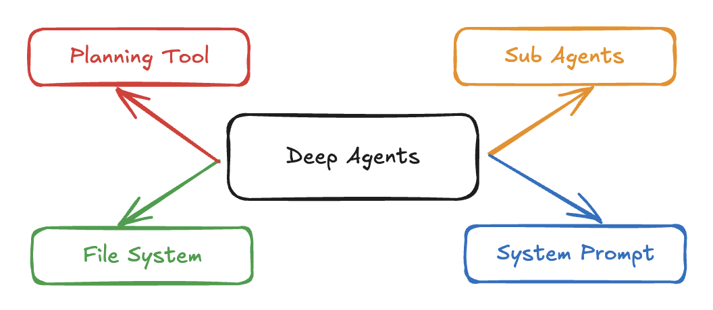

# 🧠🤖Deep Agents

Using an LLM to call tools in a loop is the simplest form of an agent. 
This architecture, however, can yield agents that are “shallow” and fail to plan and act over longer, more complex tasks. 
Applications like “Deep Research”, "Manus", and “Claude Code” have gotten around this limitation by implementing a combination of four things:
a **planning tool**, **sub agents**, access to a **file system**, and a **detailed prompt**.



`deepagents` is a Python package that implements these in a general purpose way so that you can easily create a Deep Agent for your application.

**Acknowledgements: This project was primarily inspired by Claude Code, and initially was largely an attempt to see what made Claude Code general purpose, and make it even more so.**

## Installation

```bash
pip install deepagents
```

## Usage

(To run the example below, will need to `pip install tavily-python`)

```python
import os
from typing import Literal

from tavily import TavilyClient
from deepagents import create_deep_agent


# Search tool to use to do research
def internet_search(
    query: str,
    max_results: int = 5,
    topic: Literal["general", "news", "finance"] = "general",
    include_raw_content: bool = False,
):
    """Run a web search"""
    tavily_async_client = TavilyClient(api_key=os.environ["TAVILY_API_KEY"])
    return tavily_async_client.search(
        query,
        max_results=max_results,
        include_raw_content=include_raw_content,
        topic=topic,
    )


# Prompt prefix to steer the agent to be an expert researcher
research_instructions = """You are an expert researcher. Your job is to conduct thorough research, and then write a polished report.

You have access to a few tools.

## `internet_search`

Use this to run an internet search for a given query. You can specify the number of results, the topic, and whether raw content should be included.
"""

# Create the agent
agent = create_deep_agent(
    [internet_search],
    research_instructions,
)

# Invoke the agent
result = agent.invoke({"messages": [{"role": "user", "content": "what is langgraph?"}]})
```

See [examples/research/research_agent.py](examples/research/research_agent.py) for a more complex example.

The agent created with `create_deep_agent` is just a LangGraph graph - so you can interact with it (streaming, human-in-the-loop, memory, studio)
in the same way you would any LangGraph agent.

## Creating a custom deep agent

There are three parameters you can pass to `create_deep_agent` to create your own custom deep agent.

### `tools` (Required)

The first argument to `create_deep_agent` is `tools`.
This should be a list of functions or LangChain `@tool` objects.
The agent (and any subagents) will have access to these tools.

### `instructions` (Required)

The second argument to `create_deep_agent` is `instructions`.
This will serve as part of the prompt of the deep agent.
Note that there is a [built in system prompt](#built-in-prompt) as well, so this is not the *entire* prompt the agent will see.

### `subagents` (Optional)

A keyword-only argument to `create_deep_agent` is `subagents`.
This can be used to specify any custom subagents this deep agent will have access to.
You can read more about why you would want to use subagents [here](#sub-agents)

`subagents` should be a list of dictionaries, where each dictionary follow this schema:

```python
class SubAgent(TypedDict):
    name: str
    description: str
    prompt: str
    tools: NotRequired[list[str]]
```

- **name**: This is the name of the subagent, and how the main agent will call the subagent
- **description**: This is the description of the subagent that is shown to the main agent
- **prompt**: This is the prompt used for the subagent
- **tools**: This is the list of tools that the subagent has access to. By default will have access to all tools passed in, as well as all built-in tools.

To use it looks like:

```python
research_sub_agent = {
    "name": "research-agent",
    "description": "Used to research more in depth questions",
    "prompt": sub_research_prompt,
}
subagents = [research_subagent]
agent = create_deep_agent(
    tools,
    prompt,
    subagents=subagents
)
```

### `model` (Optional)

By default, `deepagents` will use `"claude-sonnet-4-20250514"`. If you want to use a different model,
you can pass a [LangChain model object](https://python.langchain.com/docs/integrations/chat/).

## Deep Agent Details

The below components are built into `deepagents` and helps make it work for deep tasks off-the-shelf.

### System Prompt

`deepagents` comes with a [built-in system prompt](src/deepagents/prompts.py). This is relatively detailed prompt that is heavily based on and inspired by [attempts](https://github.com/kn1026/cc/blob/main/claudecode.md) to [replicate](https://github.com/asgeirtj/system_prompts_leaks/blob/main/Anthropic/claude-code.md)
Claude Code's system prompt. It was made more general purpose than Claude Code's system prompt.
This contains detailed instructions for how to use the built-in planning tool, file system tools, and sub agents.
Note that part of this system prompt [can be customized](#promptprefix--required-)

Without this default system prompt - the agent would not be nearly as successful at going as it is.
The importance of prompting for creating a "deep" agent cannot be understated.

### Planing Tool

`deepagents` comes with a built-in planning tool. This planning tool is very simple and is based on ClaudeCode's TodoWrite tool.
This tool doesn't actually do anything - it is just a way for the agent to come up with a plan, and then have that in the context to help keep it on track.

### File System Tools

`deepagents` comes with four built-in file system tools: `ls`, `edit_file`, `read_file`, `write_file`.
These do not actually use a file system - rather, they mock out a file system using LangGraph's State object.
This means you can easily run many of these agents on the same machine without worrying that they will edit the same underlying files.

Right now the "file system" will only be one level deep (no sub directories).

These files can be passed in (and also retrieved) by using the `files` key in the LangGraph State object.

```python
agent = create_deep_agent(...)

result = agent.invoke({
    "messages": ...,
    # Pass in files to the agent using this key
    # "files": {"foo.txt": "foo", ...}
})

# Access any files afterwards like this
result["files"]
```

### Sub Agents

`deepagents` comes with the built-in ability to call sub agents (based on Claude Code).
It has access to a `general-purpose` subagent at all times - this is a subagent with the same instructions as the main agent and all the tools that is has access to.
You can also specify [custom sub agents](#subagents--optional-) with their own instructions and tools.

Sub agents are useful for ["context quarantine"](https://www.dbreunig.com/2025/06/26/how-to-fix-your-context.html#context-quarantine) (to help not pollute the overall context of the main agent)
as well as custom instructions.

## Roadmap
[] Allow users to customize full system prompt
[] Code cleanliness (type hinting, docstrings, formating)
[] Allow for more of a robust virtual filesystem
[] Create an example of a deep coding agent built on top of this
[] Benchmark the example of [deep research agent](examples/research/research_agent.py)
[] Add human-in-the-loop support for tools
